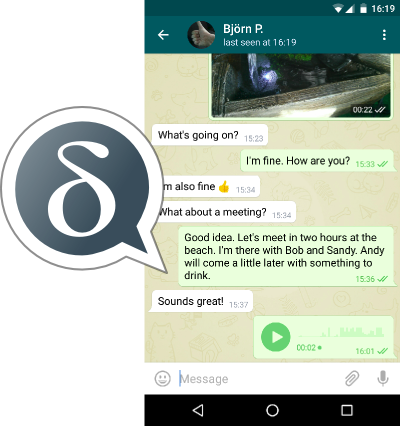
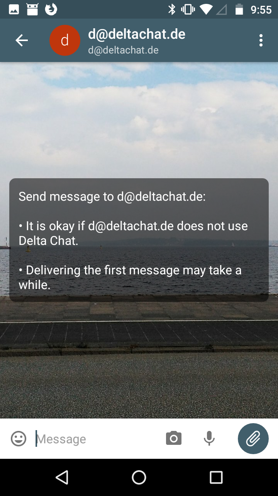

Delta Chat
=============================

OpenPGPSummit 10/21/18, Bruxelles

holger krekel, https://merlinux.eu

----

Chat Over Email
===============

- relay messages over e-mail servers

- use MIME format for interop

- use DSNs for "sent/read" ticks

-----

Delta privacy
==============

- no Delta servers, no address book upload

- e2e encryption with Autocrypt by default

- "Verified groups" against MITM

----

Impl status
=====================

- Android fully functional (F-Droid, apk)

- iOS in preview (TestFlight with ~60 users)

- Desktop evolving (dmg, deb downloads)

developments partly funded by OpenTechFund
and by the European Commission (NEXTLEAP).

----

DeltaChat C lib
==================

- SMTP/IMAP interactions (libetpan)

- contact and Chat/Group management

- Autocrypt Level 1 (currently using netpgp)

- Java, Python, Javasscript, Swift bindings

- API design driven by user interfaces

-----

OpenPGP Encryption
==================

- fully Autocrypt Level 1 compliant

- uses a fork of netpgp with fixes

- successful experiments integrating Sequoia

- implements "countermitm" verifications

----

countermitm
======================================

- countering active attacks is a concern

- countermitm research adds protection

- "don't talk with users about keys, ever!"

- new: "setup contact" and "group-join"

- good feedback from users, cryptographers

https://github.com/nextleap-project/countermitm

-----

Community
===================

- 20 voluntary translations

- 10 active contributors

- collaborating with OpenExchange

- https://support.delta.chat

- https://github.com/deltachat

----

A cuban user :)
===============

*I'm going to confess my love for the application. It is really amazing, it has made me communicate more with my friends, because writing emails is really annoying for me, I prefer chat, the world prefers chat, that's why I am eternally grateful ...*

----

A german user :)
================

*ich freue mich riesig, dass es DeltaChat gibt und dass ich es entdeckt habe.
(...)
Delta ist DIE Lösung für alle, die bereits sind, wenigstens eine
Alternative zuzulassen - Email geht immer! :)*

----

comment after user-testing
============================

*Oh, i didn't know you can use PGP without first listening to an hour of explanations!*

----

Future
==================

- complete Android/UI "dev" effort

- further Desktop and iOS developments

- releasing to app stores

**Delta-XI: Decentralization Unchained**

one-week hackathon and user-testing
sessions starting sunday Oct28 in Kyiv, Ukraine

